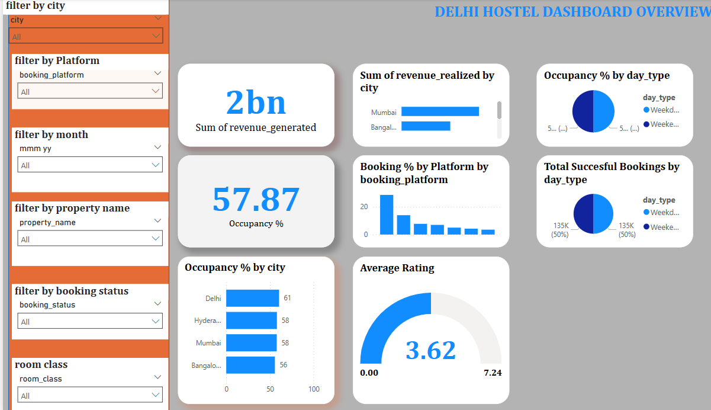
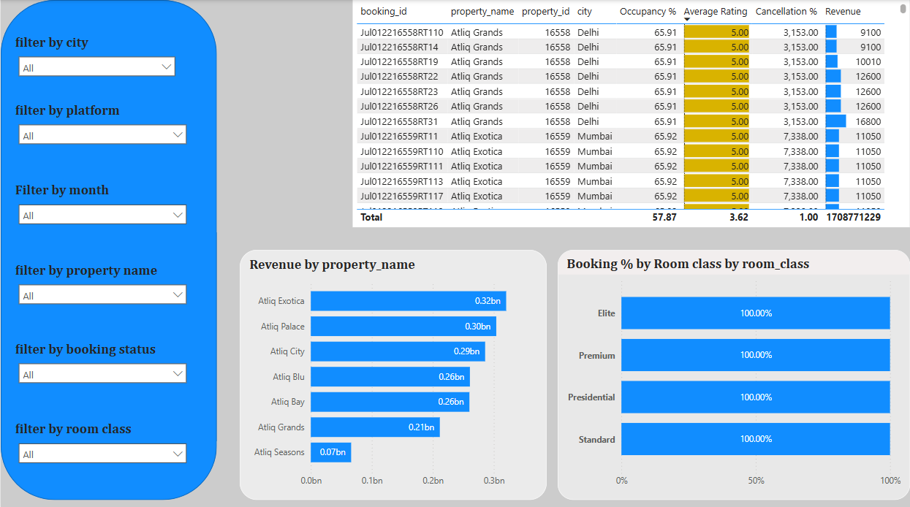
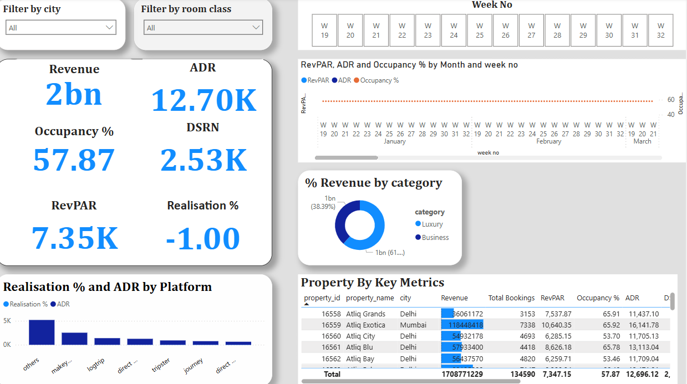

# powerbi-hotel-analysis

# 🏨 Hotel Booking Analysis – Power BI Project

This project analyzes hotel booking trends to help stakeholders make data-driven decisions around room types, revenue, and cancellations.

## 📊 Tools Used
- Power BI Desktop
- DAX (Data Analysis Expressions)
- Star Schema Data Modeling
- Excel (for source data)

## 📁 Dataset
Sourced from the [Codebasics.io End-to-End Data Analyst Project](https://codebasics.io/resources/end-to-end-data-analyst-project). It includes:
- `fact_bookings`
- `dim_date`
- `dim_hotels`
- `dim_rooms`
- `fact_aggregated_bookings`
- `key_measures`

## 📌 Key Business Questions
- What is the trend in revenue and bookings?
- Which room types perform best?
- How do cancellations affect business?
- Which market segments drive the most revenue?

---

## 📈 Dashboard Overview

The Power BI dashboard is fully interactive, featuring filters by hotel type, room type, market segment, and date.

### 🖥️ Dashboard Main View

### 💰 Revenue by Room Type

### 📊 Key Metrics Summary

---

## 🧠 What I Learned

- Data transformation using Power Query
- Star schema data modeling
- Creating meaningful KPIs using DAX
- Dashboard design for business users
- End-to-end BI reporting workflow

---

## 🔗 View the Power BI Report

📊 **[Click here to view/download the SSIMON Power BI Report](https://gtbank-my.sharepoint.com/:u:/p/shirleen_simon/ERhi5ZQUAR1JlcLiMhlu2bkBqXm8aRxVKpRVU959sUYw2w?e=TYEZRc)**

The report showcases insights on hotel performance metrics including occupancy, revenue, and booking patterns.

## 💼 Author
Shirleen Simon | [Portfolio Website](https://shirleensimon.github.io)
